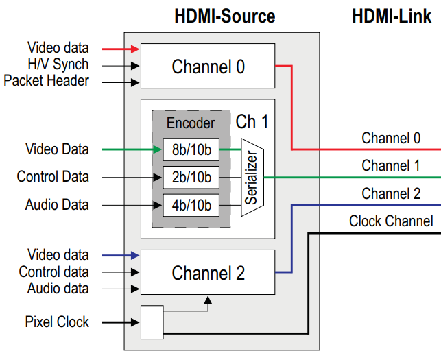
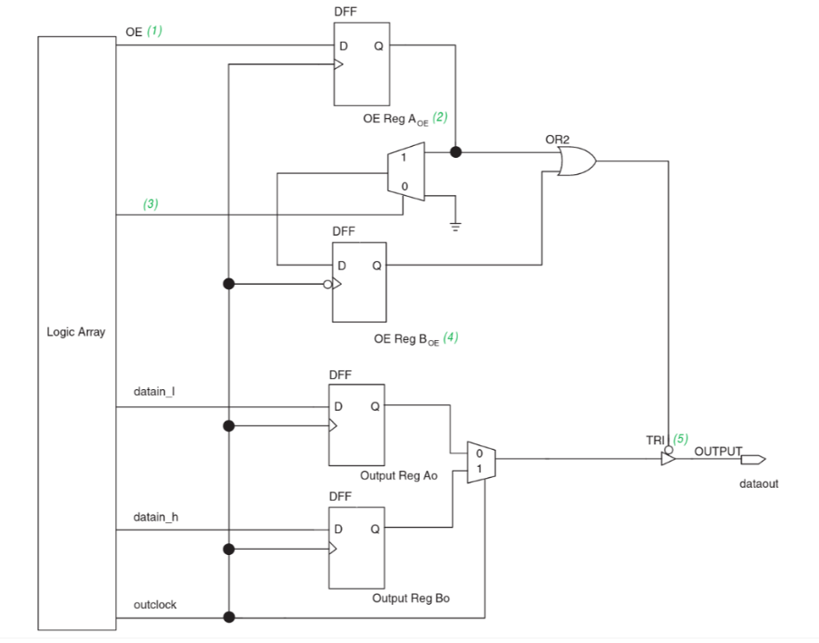
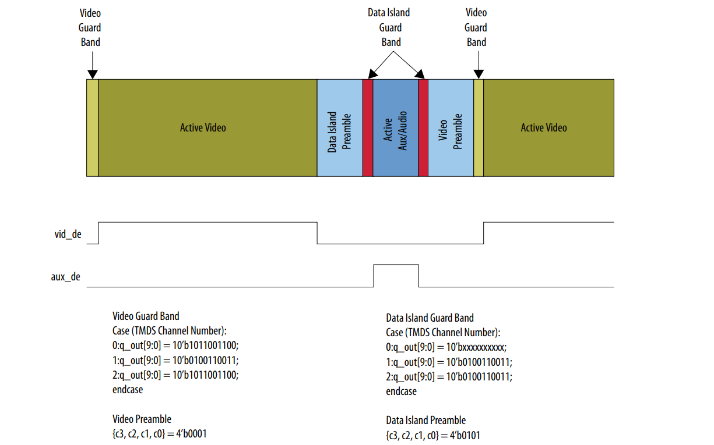
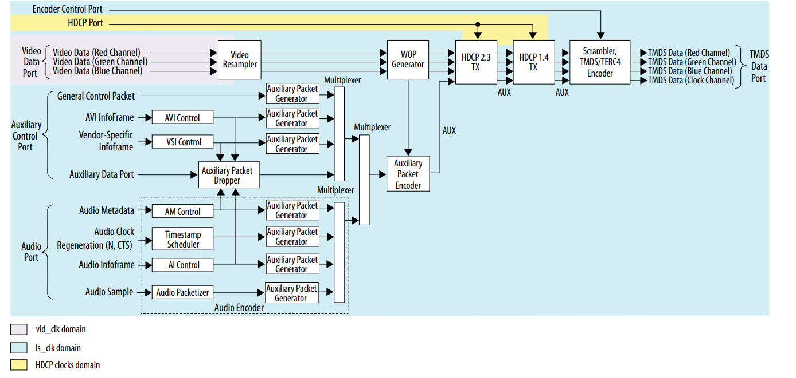
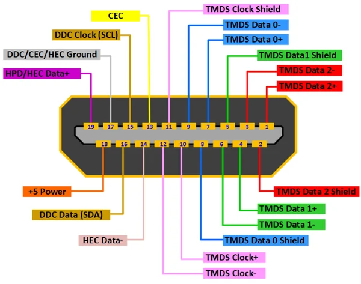

  

<h1 align="center">Modulo de vídeo
</h1>

<h3 align="center">
Deselvolvimento de um módulo de vídeo HDMI para FPGA
</h3>

<h2>TMDS</h2>

No  transmissor,  há  três  codificadores  idênticos,  onde  cada  um  está  acionando  um  canal  de  dados  TMDS  serial.  Um  cabo  HDMI  carrega  quatro  pares  diferenciais  que  compõem  os  canais  de  dados  e  clock  TMDS.  Os  canais  de dados  carregam  dados  auxiliares,  além  de  áudio  e  vídeo.

  

 Figura X: Versão simplificada do TMDS 

<h3> Clock TMDS </h3>

A frequência do clock TMDS está diretamente ligada à taxa de pixels do vídeo e serve para que o receptor sincronize a recuperação dos dados transmitidos. No transmissor, existem duas frequências de operação: a frequência mais baixa, que é o próprio clock TMDS, e a frequência de serialização, que é dez vezes maior. O sinal do clock é transmitido de forma separada pelo canal dedicado de clock TMDS.

No projeto desenvolvido, foi adotado um clock de serialização cinco vezes mais rápido que o clock TMDS. Nesse contexto, o clock TMDS opera a 25 MHz, e o clock de serialização alcança 125 MHz. Como o clock TMDS deriva do clock de pixel — que, para uma resolução de 640×480 a 60 Hz, também é de 25 MHz — foi necessário utilizar a técnica DDR (Double Data Rate). Assim, a cada ciclo de clock são transmitidos dois bits, permitindo que em cinco ciclos sejam enviados os 10 bits necessários.

Para isso, é utilizado o núcleo IP ALTDDIO_OUT, que faz parte da biblioteca de IPs de taxa de dados dupla (DDR) da Altera. Essa biblioteca inclui o ALTDDIO_IN, para interfaces de entrada DDR; o ALTDDIO_OUT, para interfaces de saída DDR; e o ALTDDIO_BIDIR, para interfaces DDR bidirecionais.

Neste módulo, o núcleo ALTDDIO_OUT implementa a interface de saída DDR, convertendo dois sinais de borda única em um sinal DDR que transmite dados tanto na borda de subida quanto na borda de descida do clock de referência.

  

Figura X: Arquitetura do núcleo ALTDDIO_OUT para transmissão de dados em DDR

<h3> Modos TMDS </h3>

O  HDMI  tem  três  modos  de  operação  TMDS  diferentes:

- Video Data Period:  Pixels  ativos  de  uma  linha  de  vídeo  ativa  são  transmitidos;

- Data Island Period:   Uma  série  de  pacotes  contendo  dados  de  áudio  e  auxiliares  é transmitido;

- Control Period:  Usado  quando  nenhum  vídeo,  áudio  ou  dados  auxiliares  precisam  ser  transmitidos.

<h3>Algoritmo TMDS</h3>

A  sinalização  diferencial  minimizada  por  transição  é  uma  tecnologia  de  transmissão  de  dados  seriais  de  alta velocidade. Um  algoritmo  de  codificação  avançado é  incorporado  no  transmissor  para  reduzir a interferência  eletromagnética  em  cabos  de  cobre  e  para  executar  o  balanceamento  CC  da  transmissão  de  dados  em  cabos  de  fibra  óptica.  Também  torna  possível  atingir  alta  tolerância  de  distorção  devido  a  uma  recuperação de  clock  mais  robusta  no  receptor.  O  algoritmo  transforma  uma  palavra  de  8  bits  em  uma  palavra  codificada TMDS  de  10  bits  em  dois  estágios.

Primeiro estágio de codificação: produzir uma palavra de 9 bits, consistindo de uma nova representação dos  8 bits de entrada e um bit de sinalização. Os 8 bits de entrada combina o bit menos significativo LSB da saída com a entrada. Os sete bits restantes da saida são derivador xnor, onde cada bit da entrada é consequentemente XNOR com o bit derivado anterior (e o LSB).

  

 Figura X: Primeiro estágio de codificação 

Algoritmo de codificação TMDS: O segundo estágio de codificação é a conversão da palavra de 9 bits em uma palavra de 10 bits. O balanceamento DC é feito invertendo seletivamente a representação de dados de 9 bits do estágio de Minimização de Transição. Isso é baseado na disparidade em execução entre uns e zeros. Se muitos zeros foram transmitidos e a representação contém mais zeros do que uns, a palavra de código é invertida. Um décimo bit é adicionado e declara se a palavra de código foi invertida ou não.

  

 Figura X: Algoritmo de codificação TMDS 

<h3>Sinalização  Diferencial</h3>

A  sinalização  diferencial  é  um  método  de  transmissão  de  informações  eletricamente  com  dois  sinais  complementares  enviados  em  dois  fios  pareados,  chamados  de  par  diferencial.  A  interferência  externa   tende  a  afetar  ambos  os  fios  igualmente,  e  um  sinal  é,  portanto,  enviado  como  o  inverso  do  outro.  A  técnica melhora  a  resistência  ao  ruído  eletromagnético  em  comparação  com  o  uso  de  fio  único  e  terra  como  uma referência  não  pareada 

<h3>Design do Transmissor</h3>

  

 Figura X: Design do Transmissor 

<h3>HDMI Encoder</h3>

  

 Figura X: Esquema de codificação 

  

 Figura X: Esquema de codificação 

  

 Figura X: Layout do codificador 

  

 Figura X: 

<h3>Pinout</h3>

  

 Figura X: Pinout do transmissor 

| GPIO        | FPGA     |LVDS(P/N)| HDMI |
|-------------|----------|---------|------|
| GPIO_1_11   | PIN_T15  | N       | DATA 2- |
| GPIO_1_12   | PIN_T14  | P       | DATA 2+ |
| GPIO_1_13   | PIN_T13  | N       | DATA 1- |
| GPIO_1_14   | PIN_R13  | P       | DATA 1+ |
| GPIO_1_15   | PIN_T12  | N       | DATA 0- |
| GPIO_1_16   | PIN_R12  | P       | DATA 0+ |
| GPIO_1_17   | PIN_T11  | N       | CLOCK - |
| GPIO_1_19   | PIN_R11  | P       | CLOCK + |

